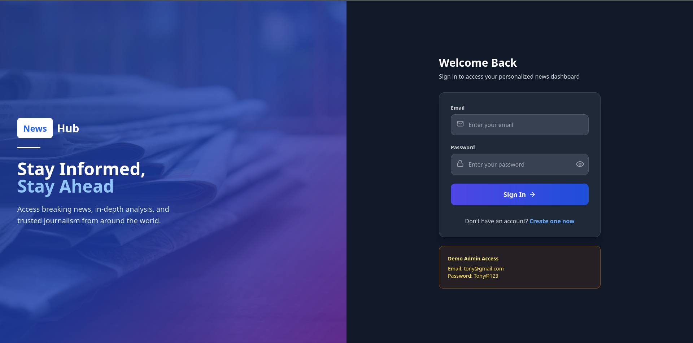
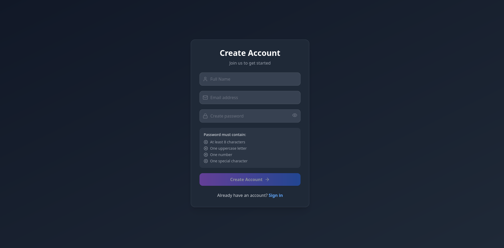
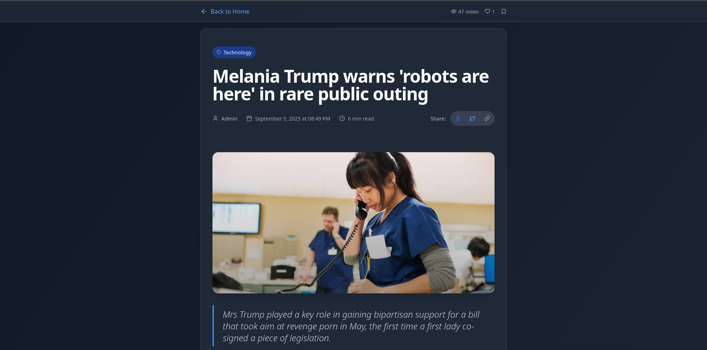
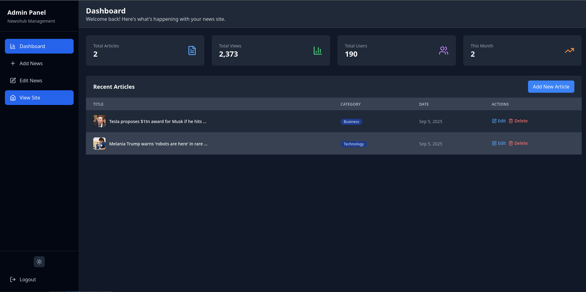

```markdown
# 📰 MERN Blogging Application

A full-stack **Blogging Platform** built using **MERN Stack** with **Tailwind CSS**, **Context API**, **Custom Hooks**, and an **Admin Dashboard**.  
Users can register, login, write blog posts, upload images, and manage content. Admins have full control via the dashboard.

---

## ⚡ Tech Stack
- **Frontend**: React, Context API, Custom Hooks, TailwindCSS
- **Backend**: Node.js, Express.js, MongoDB, JWT Authentication
- **Image Uploads**: Cloudinary
- **Database**: MongoDB Atlas
- **State Management**: React Context + Custom Hooks

---

## 📂 Project Structure
```

root/
|                   # React frontend
│── server/         # Express backend
│── .env            # Environment variables
│── package.json    # Root config

````

---

## 🚀 Getting Started

### 1️⃣ Clone the Repository
```bash
git clone <YOUR_REPO_URL>
cd <YOUR_PROJECT_FOLDER>
````

### 2️⃣ Install Dependencies

At the **root folder**:

```bash
npm install
```

Install dependencies for the **backend**:

```bash
cd server
npm install
```

Install dependencies for the **frontend**:

```bash
cd ../client
npm install
```

---

### 3️⃣ Setup Environment Variables

Create a `.env` file inside the **server/** folder and add the following keys:

```env
PORT=5000

MONGODB_URI=mongodb+srv://<username>:<password>@cluster0.lfb4sjk.mongodb.net/?retryWrites=true&w=majority&appName=Cluster0

JWT_SECRET=your_jwt_secret_here

# Cloudinary Configuration
CLOUDINARY_URL=cloudinary://<API_KEY>:<API_SECRET>@<CLOUD_NAME>
CLOUDINARY_CLOUD_NAME=your_cloud_name
CLOUDINARY_API_KEY=your_cloudinary_api_key
CLOUDINARY_API_SECRET=your_cloudinary_api_secret
```

---

### 4️⃣ Run the Application

Start the **backend**:

```bash
cd server
npm run dev
```

Start the **frontend**:

```bash
cd client
npm start
```

---

## 👨‍💻 Demo Credentials

You can log in as an **Admin** using the following credentials:

```
Email: admin@gmail.com
Password: Admin123@
```

---

## 📸 Features

* 🔐 JWT Authentication (Login, Register, Logout)
* ✍️ Create, Update, Delete Blogs
* 📷 Image Uploads via Cloudinary
* 📊 Admin Dashboard for Managing Users & Posts
* 🎨 Styled with TailwindCSS
* ⚡ Global State Management using Context API & Custom Hooks

---

## 📌 Git Commands

Clone project:

```bash
git clone <YOUR_REPO_URL>
```

Create a new branch:

```bash
git checkout -b feature-branch
```

Commit changes:

```bash
git add .
git commit -m "Added new feature"
```

Push branch:

```bash
git push origin feature-branch
```

---

## 📜 License

This project is for **learning purposes** and free to use.

---

```

---
## 📸 Screenshots

### 🔑 Authentication Pages



### 📰 Blog Pages



### 📊 Admin Dashboard



```
